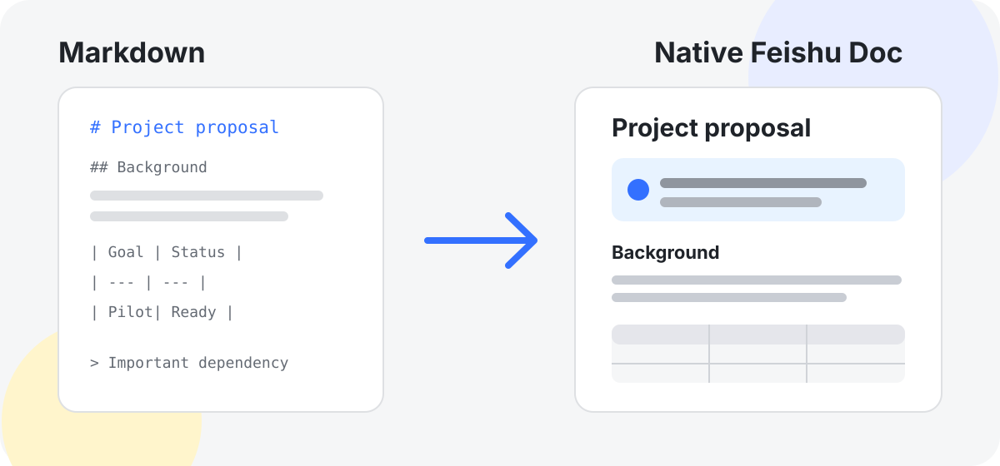
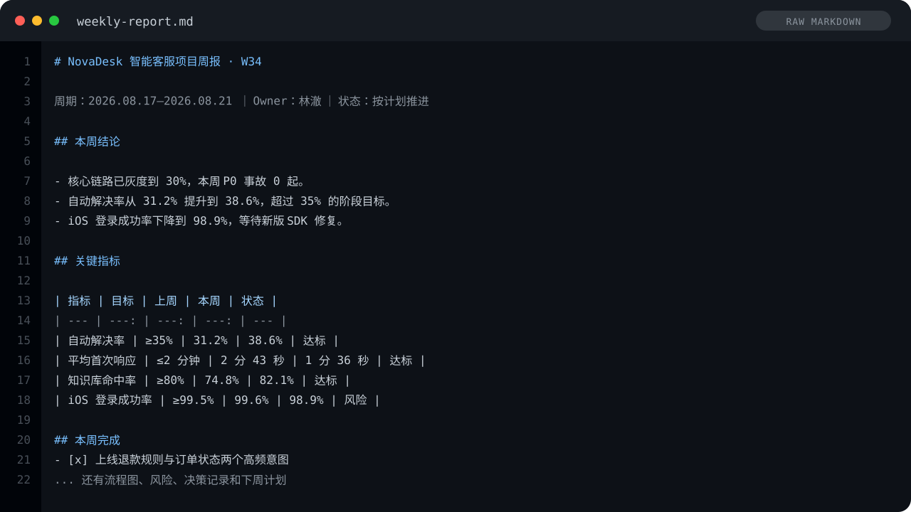
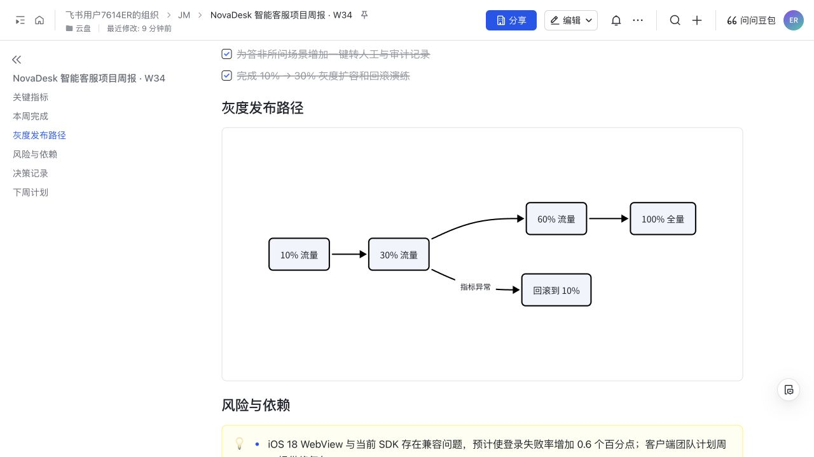

# Feishu Doc Designer

[English](README.en.md) · 飞书文档自动美化与 Markdown 发布 Skill



把本地 Markdown 自动整理为简洁、克制、可协作的飞书云文档，并一键发布返回链接。它不是把 `.md` 原样导入，而是使用飞书原生标题、Callout、高亮、表格、代码块、图片和可编辑 Mermaid 画板重新表达文档结构。

适合搜索和使用场景：**飞书文档美化**、**Markdown 转飞书**、**Markdown 导入飞书文档**、**Feishu/Lark document formatting**、**Markdown to Feishu**、AI Agent Skill。

## 为什么做这个

普通 Markdown 导入解决的是“内容进去”，不是“文档好读”。Feishu Doc Designer 采用一套 Minimal Editorial 设计系统：清楚的层级、足够的留白、少而准确的高亮，以及飞书原生组件。

| 普通 Markdown 导入 | Feishu Doc Designer |
| --- | --- |
| 基本标题和正文 | 修复标题层级，保留原有论证顺序 |
| 引用样式单一 | 按信息、提醒、结论使用克制的原生 Callout |
| Mermaid 只是代码 | 转为可编辑的飞书画板 |
| 图片路径容易失效 | 自动暂存并上传本地素材 |
| 长内容容易受 Shell 转义影响 | 通过安全的相对 `@file` 和 `shell=False` 发布 |

## Showcase：同一份周报，前后有什么不同

同一份 NovaDesk 项目周报：左侧是原始 Markdown，右侧是 `$feishu-doc-designer` 发布后的真实飞书页面。内容不变，只优化信息层级、飞书组件和视觉强调。

<table>
  <tr>
    <th width="50%">Before · 原始 Markdown</th>
    <th width="50%">After · 飞书原生设计稿</th>
  </tr>
  <tr>
    <td></td>
    <td></td>
  </tr>
</table>

设计版不是简单加颜色，而是把不同信息交给合适的飞书原生组件：

- **结论** → 浅蓝 Callout；只高亮 `30%` 和关键指标。
- **数据** → 灰色表头；绿色/黄色单元格只编码“达标 / 风险”。
- **交付** → 已完成 Checklist；**流程** → 可编辑 Mermaid 画板。
- **风险** → 浅黄 Callout；**决策** → 引用块；**计划** → 有序列表。

### 一个案例，三种组件组合

<p>
  
  
  
</p>

> 速览与指标 · Checklist 与画板 · 风险、决策与计划

查看[完整 Markdown 源码](examples/weekly-report.md)和[生成后的飞书 XML](examples/expected/weekly-report.xml)。截图来自真实发布结果，不是网页 mockup。

## 快速开始

### 1. 安装官方飞书 CLI

需要 Node.js 和 Python 3.9+：

```bash
npx @larksuite/cli@latest install
lark-cli config init --new
lark-cli auth login --recommend
lark-cli auth status
```

安装与登录说明以 [larksuite/cli](https://github.com/larksuite/cli) 为准。凭证只保存在官方 CLI 的本地配置中，不要写进本仓库。

### 2. 安装 Skill

支持 Skills CLI 的 Agent：

```bash
npx skills add Irennnne/feishu-doc-designer -y -g
```

或克隆到 Agent 的个人 skills 目录，例如 Codex：

```bash
git clone https://github.com/Irennnne/feishu-doc-designer.git \
  ~/.codex/skills/feishu-doc-designer
```

### 3. 使用

```text
Use $feishu-doc-designer to publish ./document.md to Feishu.
```

也可以指定目标位置：

```text
用 $feishu-doc-designer 把 ./proposal.md 美化并发布到飞书文件夹 fld_xxx。
```

默认直接发布，不弹出预览确认。首次使用仍需完成官方 CLI 的授权流程。

## 设计原则

- 保留事实、数字、代码、链接、图片、风险和行动项，不为排版擅自改写内容。
- GEO / SEO 只用于让这个开源 Skill 更容易被搜索引擎和 AI 找到，不会污染用户文档。
- 正文以 H2/H3 为主；颜色只表达信息、提醒、结论或风险。
- 高亮只覆盖关键词或短句，普通文档不超过三个 Callout。
- 长文缺少摘要时可以生成最多三条“速览”，每条必须能从原文直接推出。

完整规则见 [Minimal Editorial 设计系统](references/design-system.md)。

## 支持能力

- 标题、段落、粗体、斜体、删除线、短语高亮和链接
- 有序/无序列表、待办、引用与分隔线
- 表格、代码块、本地/网络图片、附件
- Mermaid → 飞书原生可编辑画板
- 个人文件夹、Wiki 节点、知识空间三种目标位置
- XML 结构、颜色、嵌套、资源路径和空文档验证
- 安全的一键发布与结构化 JSON 结果

第一版只创建新文档，不覆盖或同步已有飞书文档。

## 示例

仓库包含三个可复用测试场景：

- [方案文档](examples/proposal.md) → [预期飞书 XML](examples/expected/proposal.xml)
- [技术指南](examples/guide.md) → [预期飞书 XML](examples/expected/guide.xml)
- [项目周报](examples/weekly-report.md) → [预期飞书 XML](examples/expected/weekly-report.xml)

## 脚本接口

Skill 正常会自动调用脚本。调试时也可以手动运行：

```bash
python3 scripts/validate_payload.py ./payload.xml --base-dir ./document-assets
python3 scripts/publish_payload.py ./payload.xml --base-dir ./document-assets --dry-run
python3 scripts/publish_payload.py ./payload.xml --base-dir ./document-assets
```

目标位置三选一：`--folder-token`、`--wiki-node`、`--wiki-space`。发布器会把它们映射到当前官方 CLI 的 `--parent-token` / `--parent-position` 接口。

## 安全与限制

- 发布器使用参数数组、`shell=False` 和临时工作目录，不执行 Markdown 中的 Shell 片段。
- 本地资源必须位于 `--base-dir` 内；图片仅支持 PNG、JPEG、GIF、WebP，单图不超过 20 MiB。
- 不支持浏览器 CSS、字体、动画、渐变或固定布局；飞书客户端决定最终渲染。
- 不把 App Secret、Access Token、用户文档或授权状态写入仓库。

## 开发与验证

```bash
python3 -m unittest discover -s tests -v
python3 /path/to/skill-creator/scripts/quick_validate.py .
```

## License

[MIT](LICENSE)
