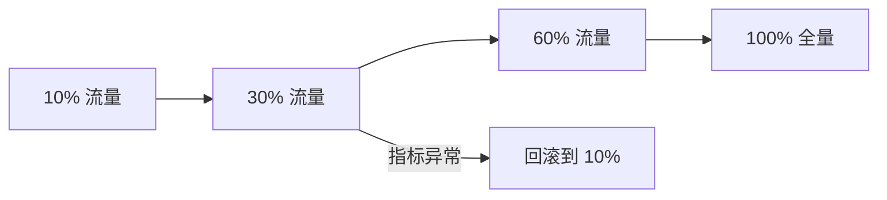

# NovaDesk 智能客服项目周报 · W34

周期：2026.08.17—2026.08.21 ｜ Owner：林澈 ｜ 状态：按计划推进

## 本周结论

- 核心链路已灰度到 30%，本周 P0 事故 0 起。
- 自动解决率从 31.2% 提升到 38.6%，超过 35% 的阶段目标。
- iOS 登录成功率下降到 98.9%，等待新版 SDK 修复。

## 关键指标

| 指标 | 目标 | 上周 | 本周 | 状态 |
| --- | ---: | ---: | ---: | --- |
| 自动解决率 | ≥35% | 31.2% | 38.6% | 达标 |
| 平均首次响应 | ≤2 分钟 | 2 分 43 秒 | 1 分 36 秒 | 达标 |
| 知识库命中率 | ≥80% | 74.8% | 82.1% | 达标 |
| iOS 登录成功率 | ≥99.5% | 99.6% | 98.9% | 风险 |

## 本周完成

- [x] 上线退款规则与订单状态两个高频意图
- [x] 为答非所问场景增加一键转人工与审计记录
- [x] 完成 10% → 30% 灰度扩容和回滚演练

## 灰度发布路径

## 风险与依赖

- iOS 18 WebView 与当前 SDK 存在兼容问题，预计使登录失败率增加 0.6 个百分点；客户端团队计划周一提供修复包。
- 生产 BI 看板权限仍在审批，数据负责人承诺周一 12:00 前确认。

## 决策记录

灰度阶段只要模型出现答非所问，就立即转人工并保留审计记录。错误率连续 24 小时低于 0.8%、满意度不低于 4.5 分后，流量可扩大到 60%。

## 下周计划

1. 验证 iOS SDK 修复包并恢复登录成功率。
2. 接入投诉分类，但继续排除法律争议类问题。
3. 指标达标后将灰度流量从 30% 扩大到 60%。
